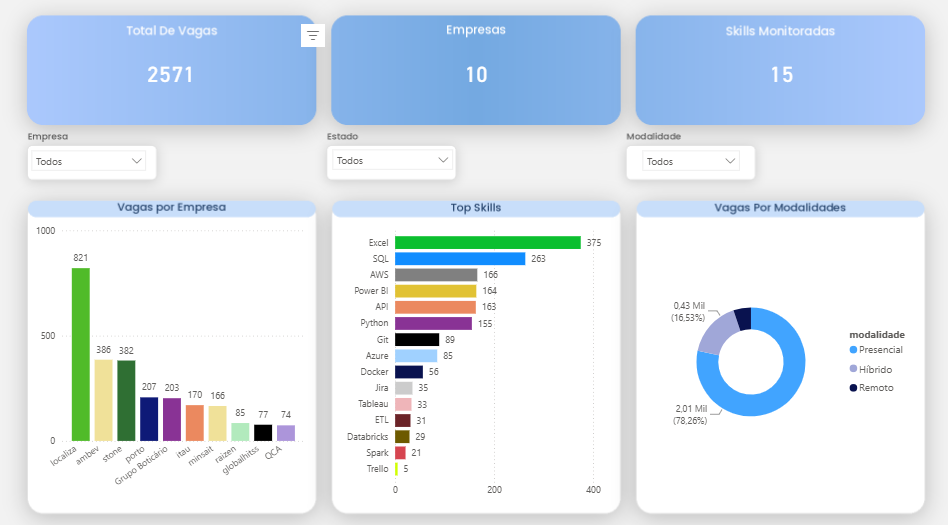
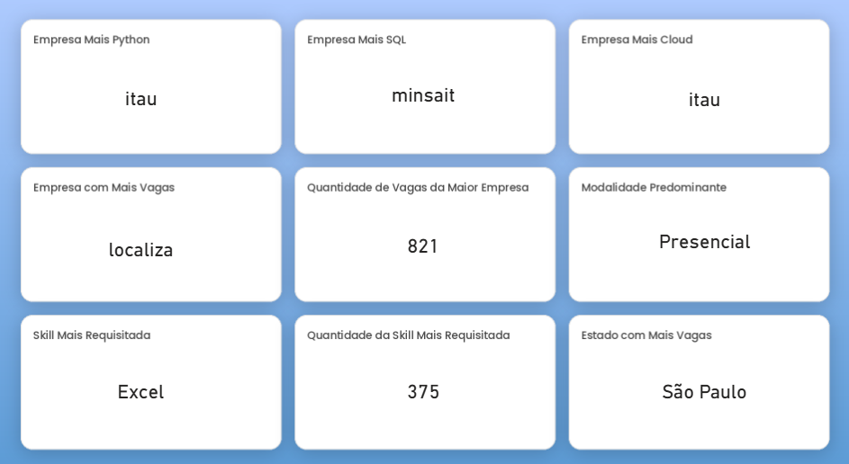

# DataJobs Intelligence

### Web Scraping • ETL • SQL Server • Power BI

Pipeline de Engenharia de Dados desenvolvido em Python para automatizar a coleta, tratamento e análise de vagas publicadas na plataforma **Gupy**. O projeto utiliza **Web Scraping**, um pipeline **ETL** completo, **SQL Server** para persistência dos dados e **Power BI** para geração de dashboards analíticos.


---

# Resultados Obtidos

O pipeline já foi executado sobre milhares de vagas reais da plataforma Gupy.

| Indicador            |    Resultado |
| -------------------- | -----------: |
| Empresas monitoradas |       **10** |
| Vagas coletadas      |   **+2.500** |
| Skills identificadas | **Milhares** |
| Banco de Dados       |   SQL Server |
| Dashboard            |     Power BI |
| Pipeline ETL         | Automatizado |
| Web Scraping         | Automatizado |
| Arquitetura          |    Escalável |

Os resultados aumentam automaticamente conforme novas empresas são adicionadas ao pipeline.

---

# Competências Demonstradas

Este projeto demonstra conhecimentos práticos em:

* Web Scraping com Requests e BeautifulSoup
* Engenharia de Dados
* Pipeline ETL (Extract, Transform and Load)
* Limpeza e transformação de dados
* Manipulação de dados com Pandas
* Banco de Dados SQL Server
* Modelagem Relacional
* SQLAlchemy
* Power BI
* Análise Exploratória de Dados
* Logging
* Barra de progresso com tqdm
* Estrutura modular de projetos Python
* Versionamento com Git e GitHub

---

# Sobre o Projeto

O mercado de tecnologia publica diariamente milhares de vagas contendo diferentes requisitos técnicos, modalidades de trabalho e perfis profissionais. Analisar essas informações manualmente torna-se inviável.

O **DataJobs Intelligence** automatiza esse processo utilizando técnicas de **Web Scraping** para coletar vagas diretamente da plataforma **Gupy**.

Após a coleta, um pipeline ETL realiza todas as etapas de tratamento dos dados, identificação automática das competências técnicas e armazenamento em SQL Server, permitindo a construção de dashboards analíticos no Power BI para identificar tendências do mercado.

Toda a arquitetura foi desenvolvida para facilitar manutenção, reutilização de código e escalabilidade, permitindo adicionar novas empresas ao pipeline com poucas alterações.

---

# Objetivos

* Automatizar a coleta de vagas da plataforma Gupy;
* Construir um pipeline ETL completo em Python;
* Centralizar os dados em SQL Server;
* Identificar automaticamente as competências mais exigidas pelo mercado;
* Comparar empresas, localidades e modalidades de trabalho;
* Disponibilizar dashboards analíticos em Power BI;
* Desenvolver uma arquitetura escalável para inclusão de novas empresas.

---

# Arquitetura

```
              Gupy

                │

                ▼

         Web Scraping

                │

                ▼

       Coleta das Vagas

                │

                ▼

   Coleta dos Detalhes

                │

                ▼

      Transformação ETL

                │

                ▼

    Extração de Skills

                │

                ▼

         SQL Server

                │

                ▼

          Power BI
```

---

# Fluxo do Pipeline

### 1. Web Scraping

Coleta automaticamente todas as vagas publicadas pelas empresas monitoradas.

### 2. Coleta dos detalhes

Captura informações completas de cada vaga:

* descrição
* responsabilidades
* pré-requisitos
* data de publicação

### 3. Transformação

Realiza:

* limpeza dos dados
* padronização dos textos
* merge das informações
* geração do dataset enriquecido

### 4. Extração de Skills

Identifica automaticamente tecnologias como:

* Python
* SQL
* Power BI
* AWS
* Azure
* Spark
* Databricks
* Docker
* Git
* Tableau
* ETL
* APIs
* Jira
* Trello
* Notion

### 5. Load

Carrega automaticamente os dados tratados para o SQL Server.

### 6. Visualização

Os dashboards são atualizados utilizando Power BI.

---

# Tecnologias Utilizadas

| Categoria          | Tecnologias             |
| ------------------ | ----------------------- |
| Linguagem          | Python                  |
| Web Scraping       | Requests, BeautifulSoup |
| Processamento      | Pandas                  |
| Banco de Dados     | SQL Server              |
| ORM                | SQLAlchemy              |
| Dashboard          | Power BI                |
| Barra de Progresso | tqdm                    |
| Logs               | Logging                 |
| Versionamento      | Git e GitHub            |

---

# Empresas Monitoradas

| Empresa         |
| --------------- |
| Ambev           |
| Globant         |
| Grupo Boticário |
| Itaú            |
| Localiza        |
| Minsait         |
| Porto           |
| QCA             |
| Raízen          |
| Stone           |

---

# Banco de Dados

O projeto utiliza três tabelas relacionais.

```
companies
     │
     ▼
jobs
     │
     ▼
job_skills
```

---

# Estrutura do Projeto

```
DataJobsIntelligence

│
├── data/
│   ├── raw/                  # Dados brutos coletados da Gupy
│   └── processed/            # Dados tratados, enriquecidos e rankings
│
├── docs/
│   ├── images/               # Imagens utilizadas no README
│   └── powerbi/              # Arquivo .pbix e documentação do dashboard
│
├── sql/
│   ├── consultas/            # Consultas SQL utilizadas nas análises
│   └── views/                # Views do banco de dados
│
├── src/
│   ├── database/             # Conexão e carga no SQL Server
│   ├── pipeline/             # Pipeline principal da aplicação
│   ├── processing/           # ETL, merge e análise de skills
│   ├── scraping/             # Web Scraping das vagas da Gupy
│   ├── utils/                # Logger, Timer e utilitários
│   └── config.py             # Configuração das empresas monitoradas
│
├── .env.example              # Exemplo das variáveis de ambiente
├── .gitignore
├── README.md
└── requirements.txt

```
---

# Dashboard

**Dashboard Online**

https://app.powerbi.com/view?r=eyJrIjoiZDA2OWRjNjYtM2ZjOC00MmVlLWI0ZWUtNWMwOTg5NWMxYTExIiwidCI6IjY1OWNlMmI4LTA3MTQtNDE5OC04YzM4LWRjOWI2MGFhYmI1NyJ9


## Preview do Dashboard

### Página Principal



### Página de Insights




---

# Principais Insights

Os dashboards permitem analisar:

* Total de vagas monitoradas;
* Empresas com maior número de vagas;
* Skills mais requisitadas;
* Empresas que mais exigem Python;
* Empresas que mais exigem SQL;
* Empresas que mais exigem tecnologias Cloud;
* Distribuição das vagas por estado;
* Modalidade predominante de trabalho.

---

# Como Executar

Clone o repositório

```bash
git clone https://github.com/geraldomendz/DataJobsIntelligence.git
```

Entre na pasta

```bash
cd DataJobsIntelligence
```

Crie um ambiente virtual

```bash
python -m venv venv
```

Ative o ambiente

Windows

```bash
venv\Scripts\activate
```

Linux

```bash
source venv/bin/activate
```

Instale as dependências

```bash
pip install -r requirements.txt
```

Configure o arquivo `.env`

```
SERVER=
DATABASE=
USERNAME=
PASSWORD=
```

Execute

```bash
python src/pipeline/run_pipeline.py
```

---

# Próximas Melhorias

* Containerização com Docker
* Agendamento automático do pipeline
* Histórico temporal das vagas
* Integração com Apache Airflow
* Deploy em Cloud
* Inclusão de novas empresas monitoradas

---

# Autor

**Geraldo Mendes de Pontes Neto**

Graduando em Sistemas de Informação — Universidade Federal da Paraíba (UFPB)

Foco em Engenharia de Dados, ETL, Python, SQL e Power BI.

**GitHub**

https://github.com/geraldomendz

**LinkedIn**

https://www.linkedin.com/in/geraldo-mendes-11385a321/
